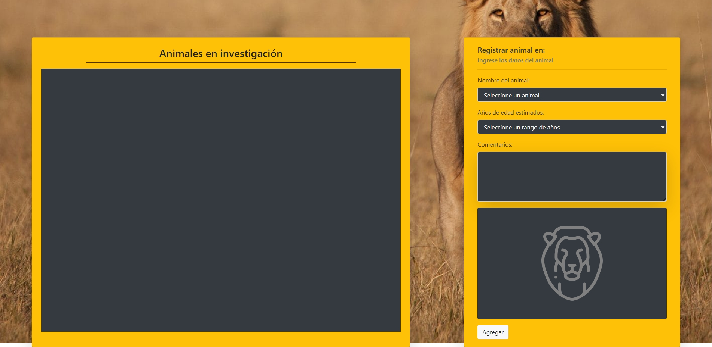
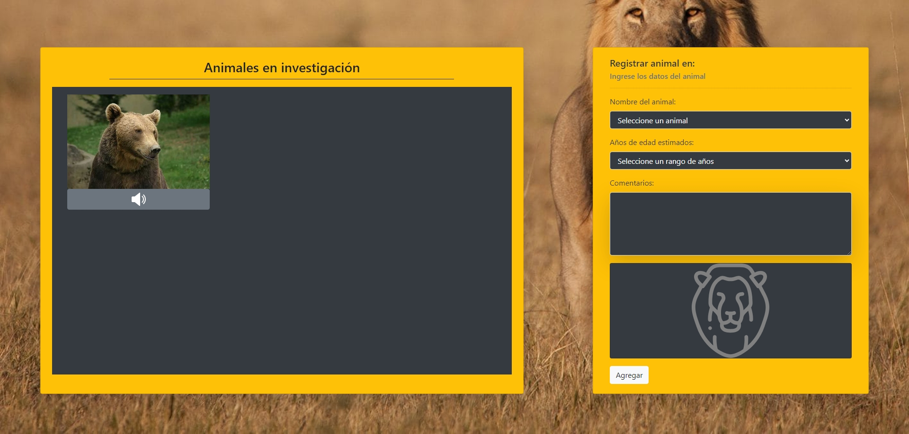
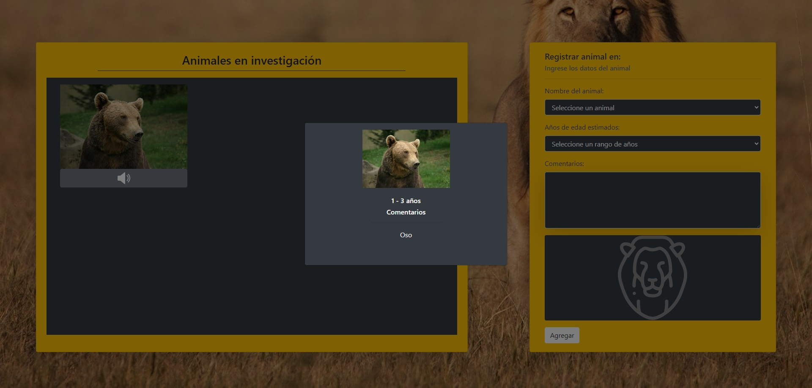

# Prueba - Programación avanzada en JavaScript

En Australia se están realizando investigaciones con algunos animales salvajes y necesitan
crear un sitio web que permita registrar los comentarios de los investigadores. En esta prueba
deberás crear una aplicación web que permita agregar en una tabla los animales en
investigación, utilizando el paradigma POO para la creación de las instancias que representen
los diferentes animales con sus atributos y métodos.

