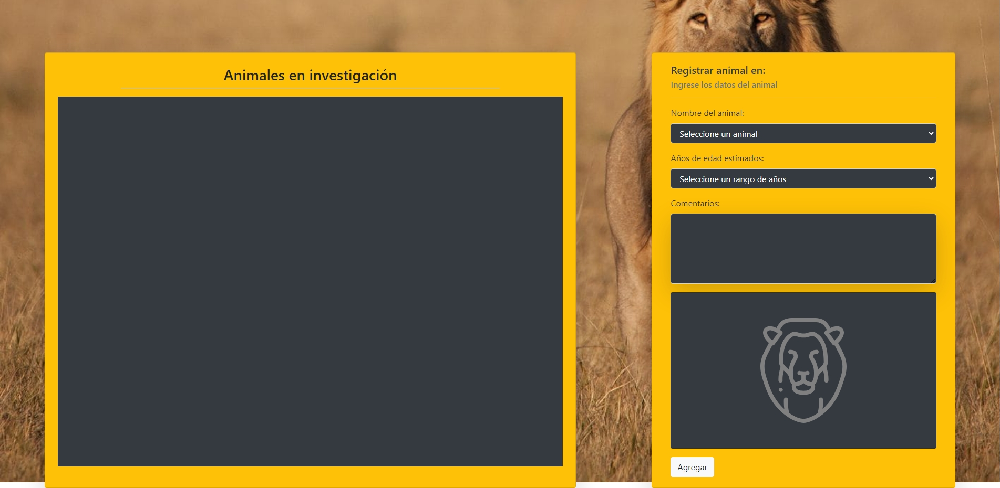
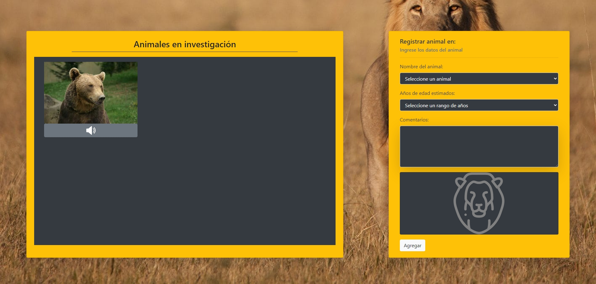
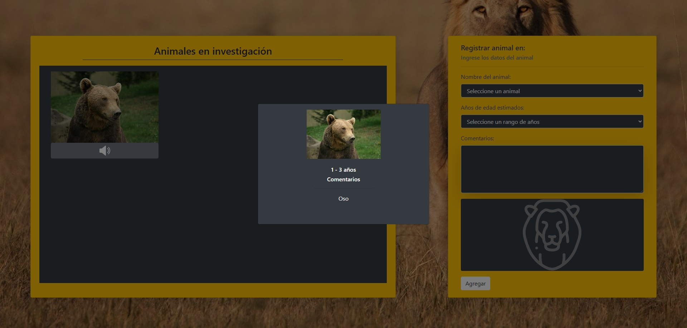

# Prueba - Programación Avanzada en JavaScript

## Descripción

En Australia, se están realizando investigaciones con algunos animales salvajes y se necesita crear una aplicación web para registrar los comentarios de los investigadores. Esta prueba requiere construir una aplicación que permita agregar y visualizar datos sobre los animales en investigación en una tabla. El proyecto utilizará el paradigma de Programación Orientada a Objetos (POO) para manejar instancias que representen los diferentes animales con sus atributos y métodos.

## Vista Codificada

A continuación, se muestra la imagen del resultado codificado:

## Requisitos

1. **Crear una interfaz de usuario (UI) interactiva**:
   - Una tabla para mostrar los animales en investigación.
   - Un formulario para ingresar los datos del animal, incluyendo:
     - Nombre del animal (seleccionable desde un menú desplegable).
     - Años de edad estimados (seleccionable desde un menú desplegable).
     - Comentarios adicionales.
   - Un botón para registrar el animal en la tabla.

2. **Implementar Programación Orientada a Objetos (POO)**:
   - Utilizar clases para crear instancias de animales con atributos y métodos.
   - Gestionar los datos y operaciones relacionadas con los animales usando estas instancias.

3. **Utilizar Bootstrap para el diseño y estilo de la aplicación**:
   - La interfaz debe estar bien estructurada y ser visualmente atractiva utilizando Bootstrap.

4. **Manejo de eventos y dinámicas en JavaScript**:
   - Implementar funcionalidades para agregar nuevos animales a la tabla y visualizar los datos ingresados.

## Estructura del Proyecto

El proyecto se compone de las siguientes secciones:

- **Menú de Navegación (`<nav>`)**: Contiene enlaces a las diferentes secciones de la página, incluyendo Acerca de mí, Trabajos y Contacto.
- **Encabezado (`<header>`)**: Presenta el título principal y una breve descripción de la página.
- **Sección Acerca de mí (`<section class="container text-center py-5">`)**: Proporciona información sobre Olivia y sus áreas de especialización.
- **Sección Mis trabajos (`<section class="bg-mis-trabajos py-5">`)**: Muestra una galería de trabajos anteriores con imágenes y descripciones.
- **Sección Contáctame (`<section>`)**: Incluye un formulario de contacto para que los usuarios puedan enviar mensajes.
- **Pie de Página (`<footer>`)**: Contiene un mensaje de derechos reservados.

## Tecnologías Utilizadas

- HTML5
- CSS3
- Bootstrap
- JavaScript
- jQuery

## Autor

Este proyecto fue desarrollado por **Valeria Torrealba**.
